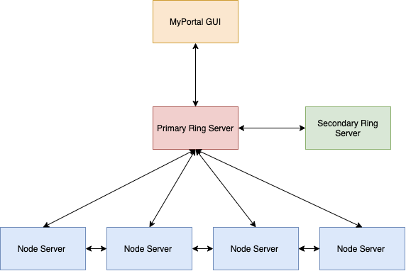

# 50.041 Distributed Systems and Computing Project

## Introduction
Our project focuses on creating a key-value distributed storage system with features similar to that of Amazon’s DynamoDB. Certain features that allow DynamoDB to ensure reliability and efficiency on a large scale that we plan to implement are scalability, high availability, and fault tolerance.

## Overview
The SUTD Subject Enrolment System is prone to lags and server failures when there is a surge in the number of transactions, especially at around 9am on the first day of enrolment. Furthermore, some users complain of being unable to enrol into the subject despite the system showing its availability. This may be due to poor scalability or load balancing. As a result, there is a need for a better-designed distributed system to ensure high availability with eventual consistency.

## Overall System Architecture
The overall system architecture can be represented by the diagram below.

The overall system architecture comprises 2 core components – front-end and back-end. The back-end should be able to simulate a realistic distributed system and display core features of DynamoDB such as consistent hashing for high scalability and replication for high availability. For databases, we will be leveraging a simple file system that allows for read and write of key-value pairs. The front-end consists of a GUI that serves as an intuitive demonstration for a booking system. It should be capable of simple booking functionalities via GET and PUT requests with the back-end. For simple demonstration purposes, the above implementation will be simulated on a local machine.

## Features
The distributed database we have built consists of the following features: 

| Feature                      | Rationale                                                                                                                                                                                                                         | Technique                        |
|------------------------------|-----------------------------------------------------------------------------------------------------------------------------------------------------------------------------------------------------------------------------------|----------------------------------|
| Scalability                  | We want our system to be able to scale horizontally as the number of transactions increase. Consistent hashing will allow us to avoid having to rehash all the keys when scaling the system, thus ensuring smooth load balancing. | Consistent hashing               |
| High availability for writes | Students should be able to add or remove classes even amidst server failures. Ability to write to any one server at any point of time. Can compromise some consistency to reduce lag.                                             | Replication                      |
| Fault Tolerance (RingServer) | The RingServer acts as a middleman for the frontend and the nodes. It is important to consider fault tolerance for the RingServer because it is a central point of failure.                                                       | Primary and Secondary RingServer |

## How to Setup
### Web Application
* cd into the WebApp folder and run the command 'npm run start'.

### Distributed Database
* cd into the DistributedDatabase Folder
* To run the RingServer, run the command 'go run ringserver.go'
* To run a NodeServer, run the command 'go run nodeserver.go'
