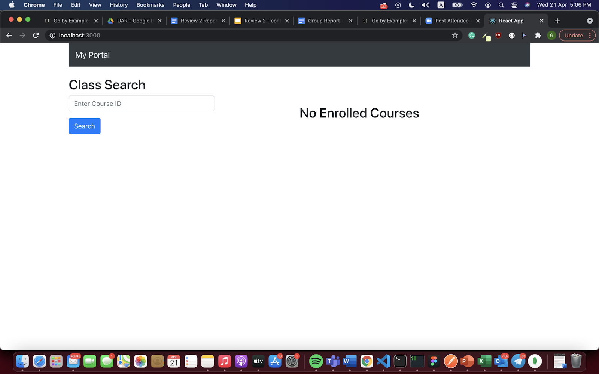
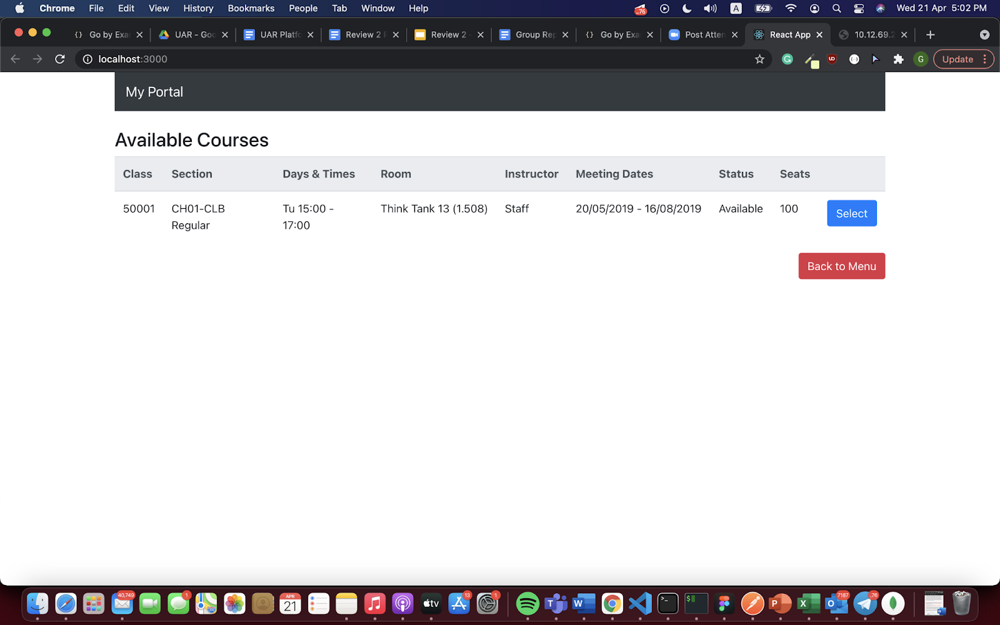
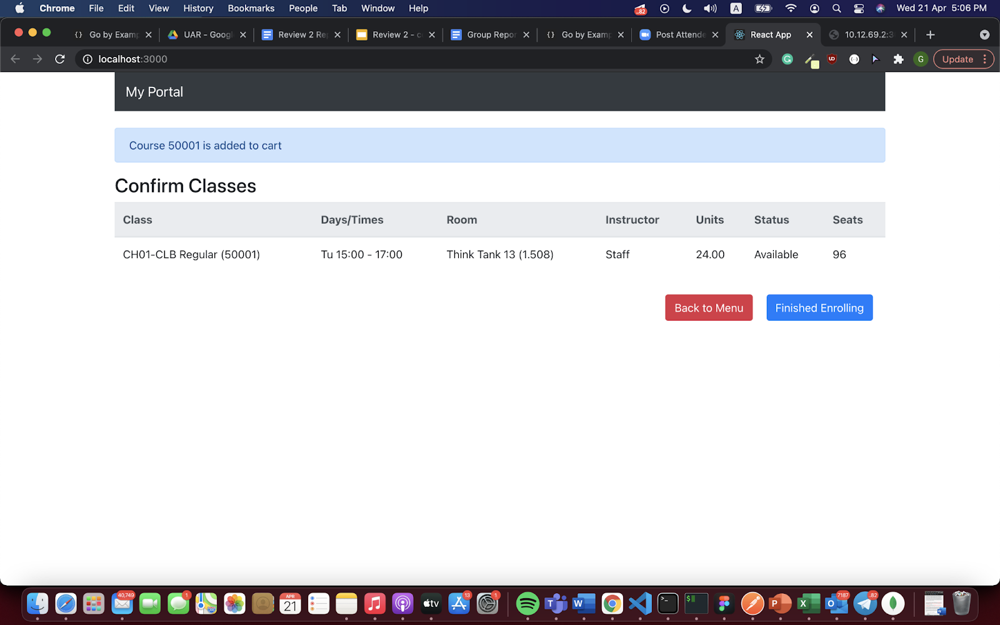
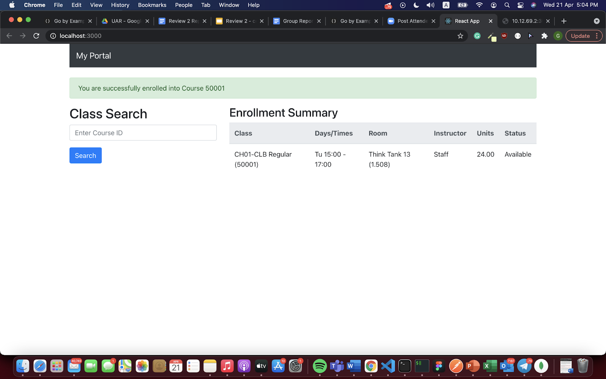
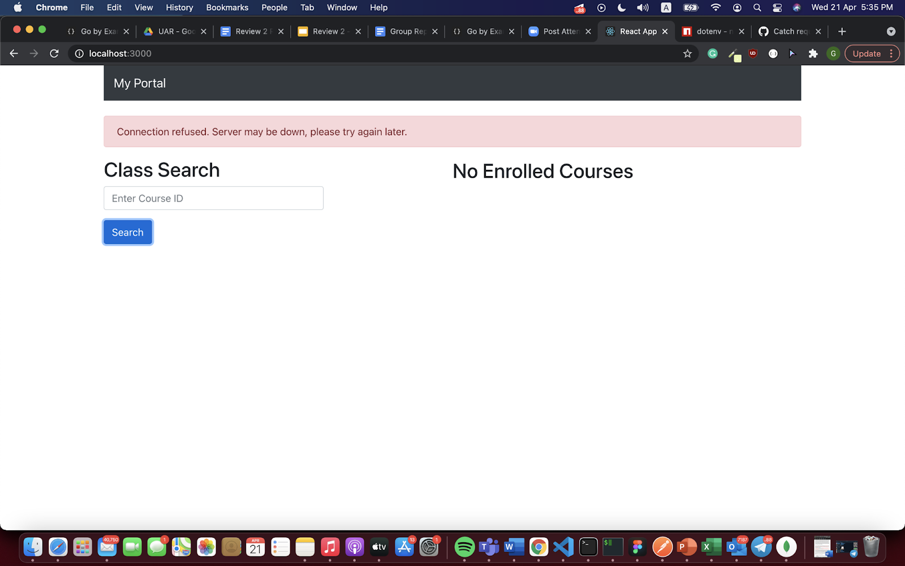

# Subject Enrolment System

Web Application for SUTD Subject Enrolment System, created using React.

## How to Setup
* Run the command 'npm run start'

## How to Use

### Add to Enrollment Cart
The home page is as shown below. Use the search bar to search for the desired CourseID.

If the courseID matches an existing course, the course description with its number of available seats will be displayed.

Click 'Select' to add to cart.

### Finish Enrolling
To finish enrolling for the selected course(s), click on the 'Finished Enrolling' button.

The database will indicate whether the enrollment is successful:

...or not:

